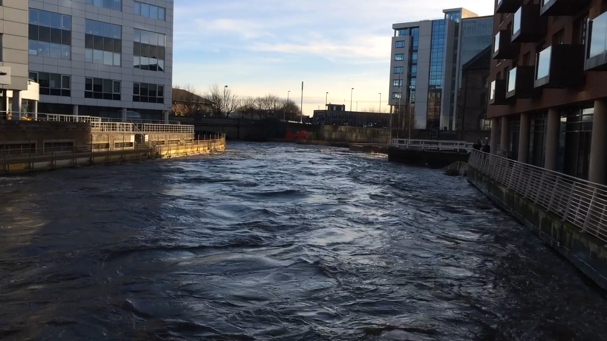
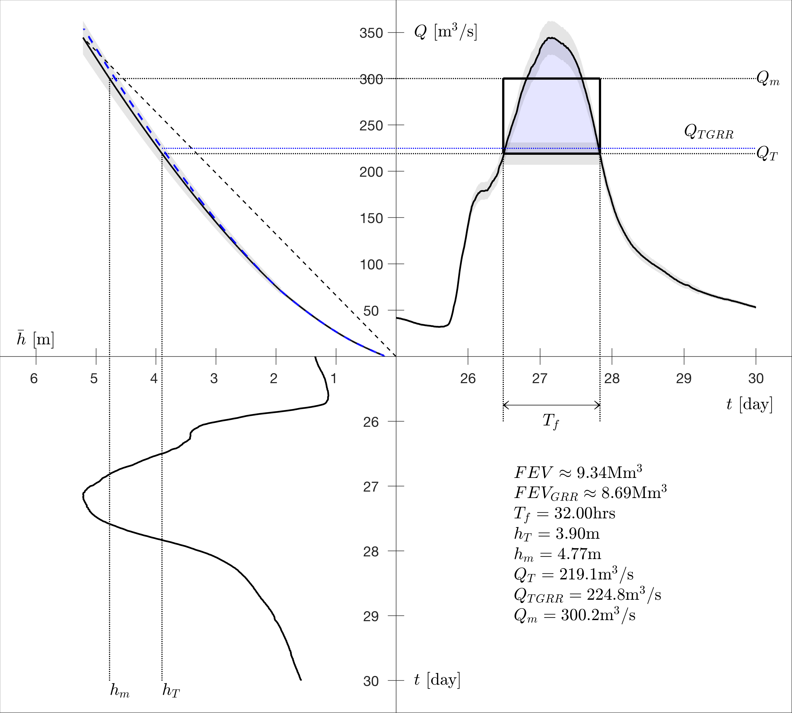
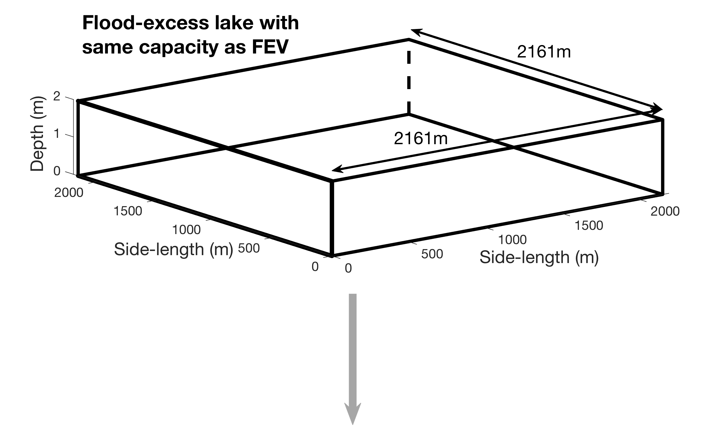
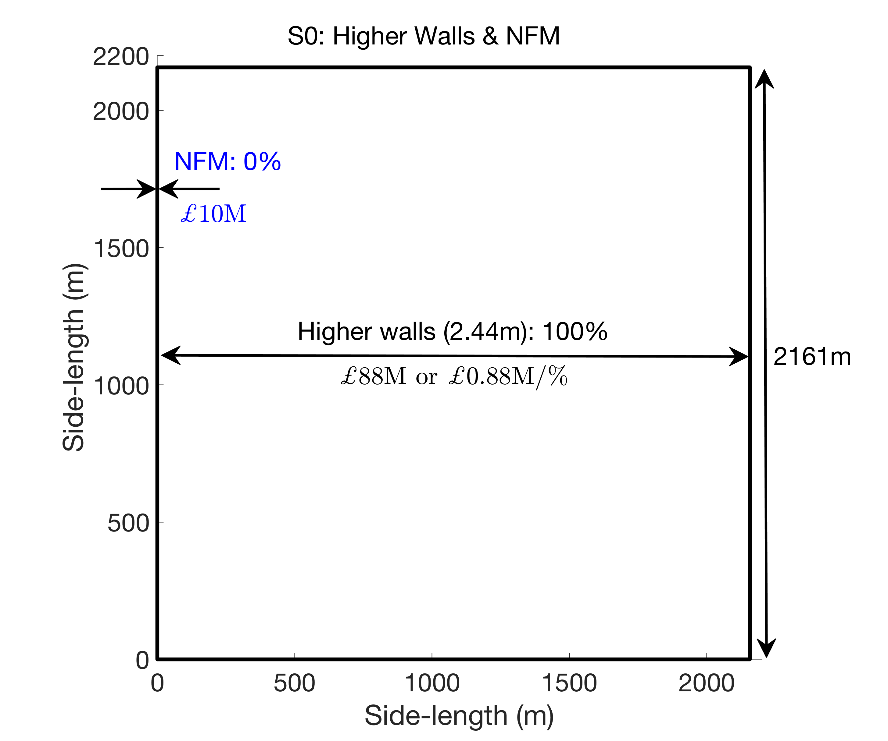

# RiverAire

## FEV analysis for the Boxing day 2015 flood of the River Aire, Leeds

Work published in the special issue 'Challenges and Perspectives in Flood Risk Management and Resilience' as: 

Bokhove, O., Kelmanson, M.A., Kent. T., Piton, G. and Tacnet, J.-M. (2020): A cost-effectiveness protocol for flood-mitigation plans based on Leeds' Boxing Day 2015 floods. *Water*, **12**, 652. [DOI](https://doi.org/10.3390/w12030652).

See also:
* An [accessible blog](https://research.reading.ac.uk/dare/2018/09/27/using-flood-excess-volume-to-quantify-and-communicate-flood-mitigation-schemes/) on the concept of FEV first applied to the River Aire.
* 'Using flood-excess volume to assess and communicate flood-mitigation schemes': [presentation](http://www1.maths.leeds.ac.uk/~amttk/files/leedskyoto.pdf) and [poster](http://www1.maths.leeds.ac.uk/~amttk/files/INI_sept2018.pdf). 
* ...

### Graphical output 
#### Data analysis: from depth to discharge to FEV

#### Concept: re-express FEV as a square 'flood-excess lake'

#### Cost-effectiveness analysis: scenarios

           | 
:-------------------------:|:-------------------------:
           | 
