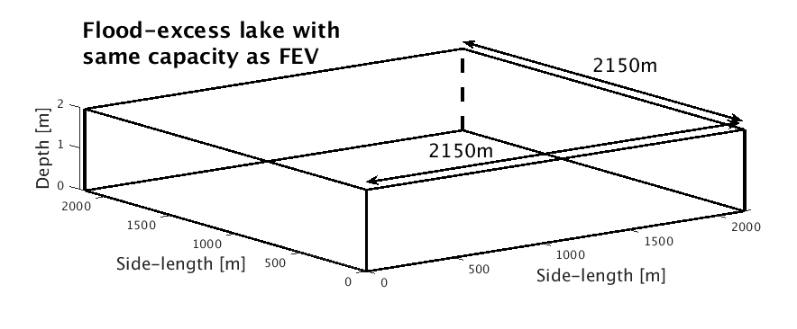
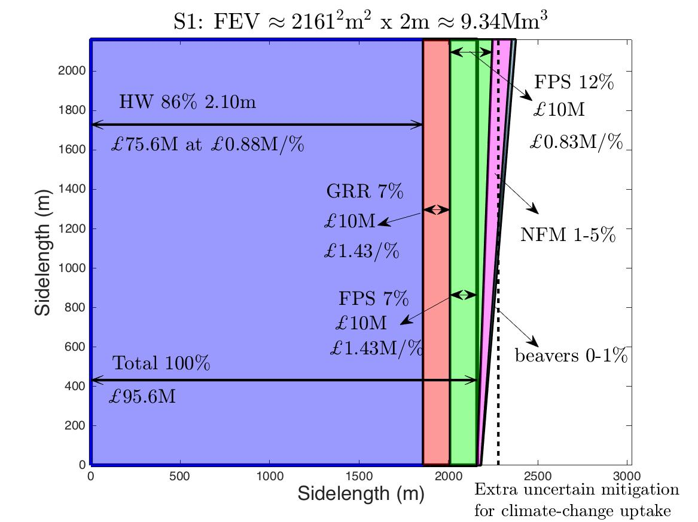
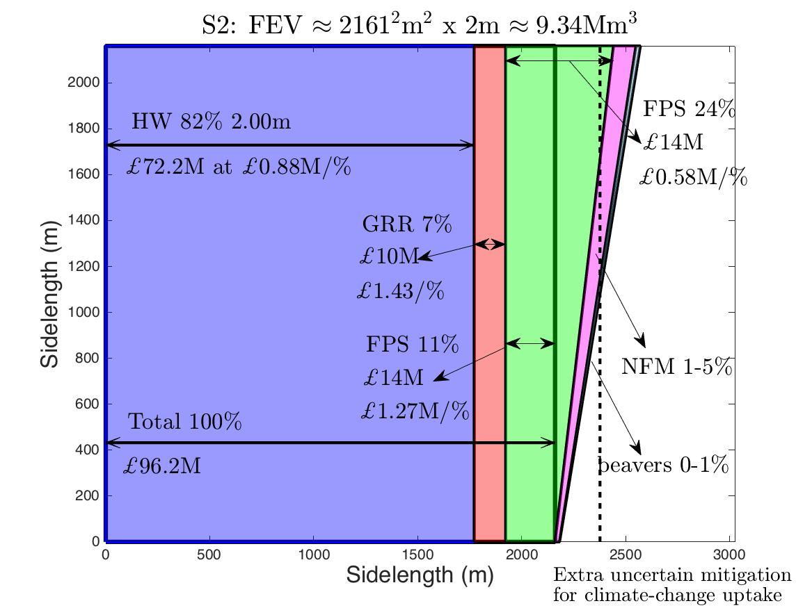
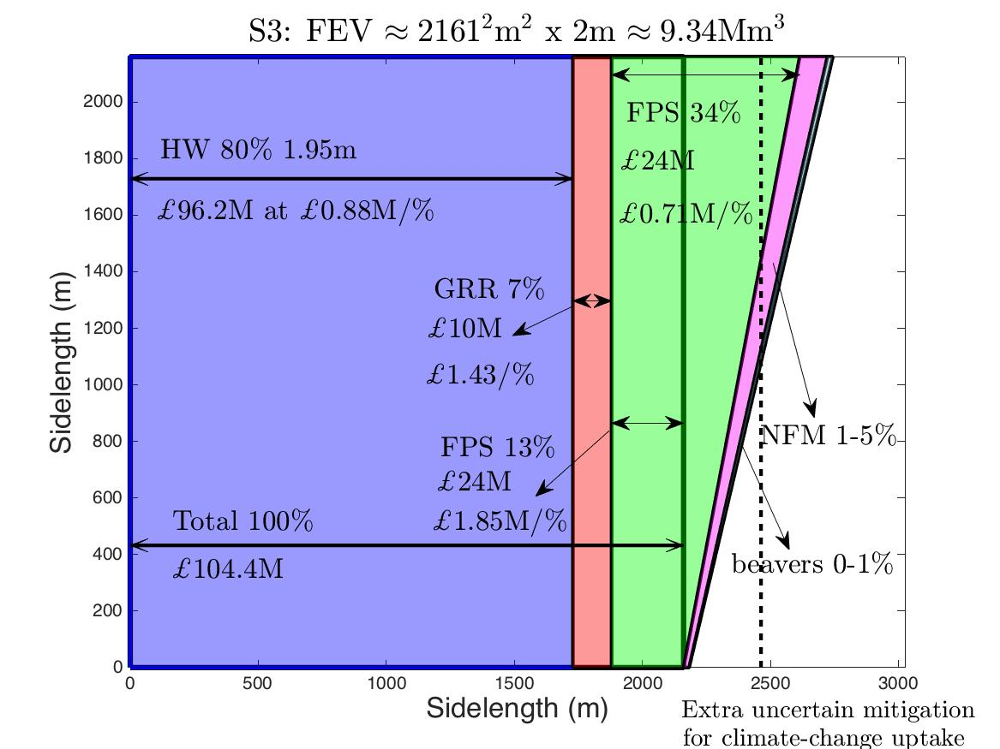
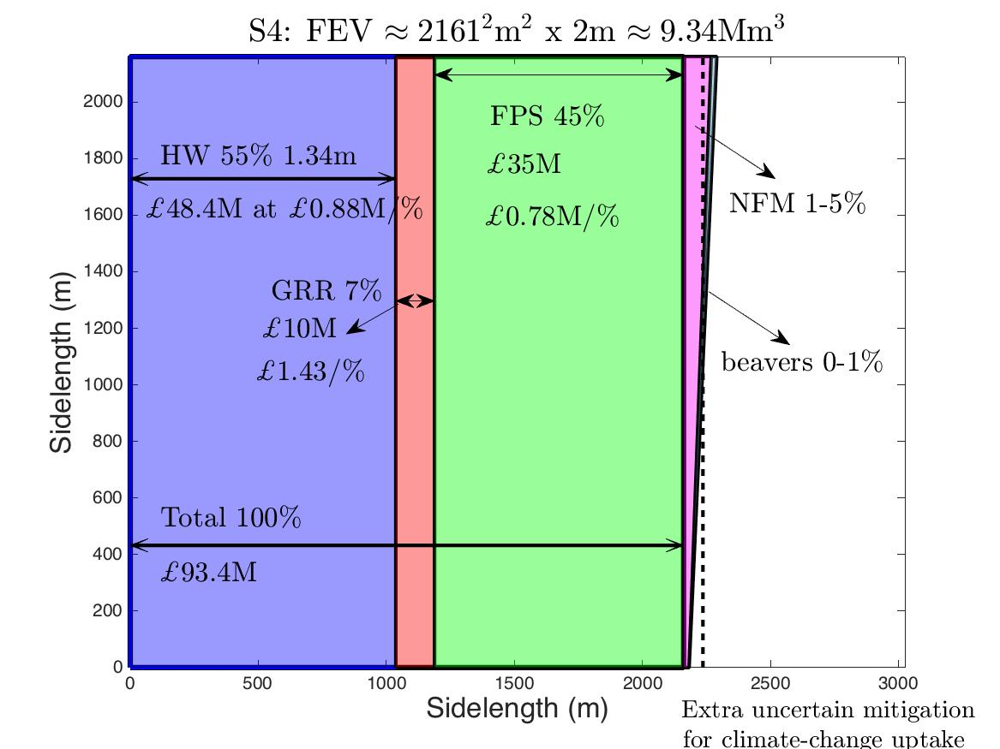

# RiverAire


## FEV analysis for the Boxing day 2015 flood of the River Aire, Leeds

Work published in the special issue 'Challenges and Perspectives in Flood Risk Management and Resilience' as: 

Bokhove, O., Kelmanson, M.A., Kent. T., Piton, G. and Tacnet, J.-M. (2020): A cost-effectiveness protocol for flood-mitigation plans based on Leeds' Boxing Day 2015 floods. *Water*, **12**, 652. [DOI](https://doi.org/10.3390/w12030652).

*Above photo (credit Onno Bokhove): high river levels near Leeds train station on 27/12/2015.*

See also:
* An [accessible blog](https://research.reading.ac.uk/dare/2018/09/27/using-flood-excess-volume-to-quantify-and-communicate-flood-mitigation-schemes/) on the concept of FEV first applied to the River Aire.
* 'Using flood-excess volume to assess and communicate flood-mitigation schemes': [presentation](http://www1.maths.leeds.ac.uk/~amttk/files/leedskyoto.pdf) and [poster](http://www1.maths.leeds.ac.uk/~amttk/files/INI_sept2018.pdf). 
* ...

### Graphical output 
#### Data analysis: from depth to discharge to FEV
From the ```/code``` dir, run: 
 * ```quadrantplot_armley.m``` (without Giving-Room-to-the-River)
 * ```quadrantplot_armleyplus.m``` (with Giving-Room-to-the-River)
 
Running, e.g., ```quadrantplot_armleyplus.m``` calls four plotting routines at the end of the sript:
 * ```plot3panelgrr;```
 * ```plotFEVhT;```
 * ```plot_h_year;```
 * ```plot_ratingcurve;```
 
in total, six figures are produced, including figure 4 below from Bokhove et al, 2020.


*Caption (adapted from Bokhove et al, 2020): The rating curve including errors (solid line, top-left panel) and its linear approximation (dashed line) are displayed as well as river levels (lower-left panel) and peak-flow rates including errors (top-right panel) of the River Aire at Armley, Leeds, around Boxing Day 2015. Dotted lines indicate a chosen threshold, the corresponding discharge and a mean river level. The flood-excess volume (FEV) is found by determining the blue-shaded “area”, under the discharge curve displayed on the vertical axis as a function of time t on the horizontal axis. It involves the in-situ river level h = h(t) as a function of time t above a threshold discharge Q_T = Q(h_T). Given a rating curve, QT is fixed once a chosen threshold river level, here h_T = 3.9m, has been provided. The flood duration for threshold hT is T_f = 32hrs. The rectangle represents the mean FEV, V_e ≈ 9.34Mm3/s. The dashed-line correction to the rating curve concerns giving-room-to-the-river (GRR) or river-bed widening. It leads to a higher threshold Q_TGRR with a reduced FEV for the same river-level threshold h_T. The grey shading denotes the error in Q due to rating-curve uncertainty (not shown for the GRR curve). Data from Environment Agency.*

#### Concept: re-express FEV as a square 'flood-excess lake'



#### Cost-effectiveness analysis: scenarios
Run ```armleynewsql2020.m```. Text annotations are added ('point-and-click') manually for each of the scenarios -- see the gtext('...') commands for each case.

 | 
:-------------------------:|:-------------------------:
 | 

*Figure 10 (from Bokhove et al, 2020): Scenarios S1 to S4 with contribution of each flood-mitigation measure proportional to the length of the (inverted) double-headed arrows. Contributions to the square flood-excess lake (of the same capacity as the FEV) are: higher walls with wall-heights indicated (HW—mauve); river-bed widening (GRR—red); and (enhanced) flood-plain storage (FPS—green). The uncertain, slanted parts of FPS, natural flood management (NFM—pink) and beaver colonies (small sliver—blue) are used as extra flood mitigation to offset climate-change effects, beyond the 2161 m side, with the mean denoted as the vertical dashed line. Above or alongside the double arrow the total percentage of protection for each flood-mitigation measure is given; below the double arrow costs and relative cost per 1% of flood mitigation are stated. Total costs are indicated under the double arrow spanning the lake width.*
